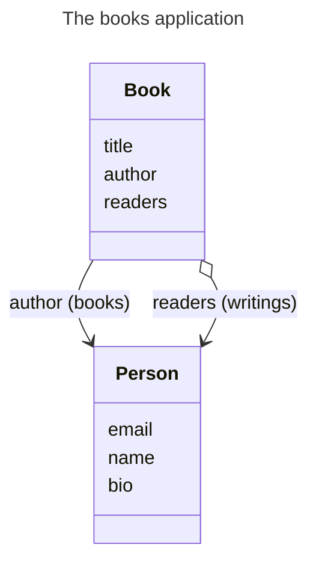

# Gitguardian Engineering Blog Playground

Welcome to this playground. You can test all tips of [10 tips to optimize PostgreSQL queries in your Django project](https://www.gitguardian.com) using this repo.


## Quickstart

### Requirements

To run this playground, you'll need

- [Pipenv](https://github.com/pypa/pipenv)
- [Docker](https://www.docker.com/products/docker-desktop/)

### Usage

1. Install virtualenv

```
pipenv install -d
```

2. Setup your environment

Copy the example env file

```
cp .env.example .env
```

Edit `.env` by setting a PostgreSQL password and a Django Secret Key.

3. Activate your environment

```
pipenv shell
```

4. Start your PostgreSQL container

```
docker compose up -d
```

5. Open a notebook

```
./manage.py shell_plus --notebook
```

You are now ready to start ;)

## Our Sample App

This notebook is based on the `books` Django Application that includes two Models:

- Book
- Person

A Person can be either the `author` of a Book or one of its `readers`.
All books written by a Person can be accessed through the `writings` related name of the `author` ForeignKey.
The `readers` relation is defined as a ManyToManyField, accessible from Person using `writings` related name.



We also provide a `generate_data` Django command to populate the database with enough data to get meaningful results when playing with queries.
