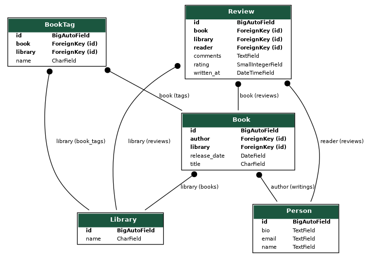

# Gitguardian Engineering Blog Playground

Welcome to this playground. You can test all tips of [10 tips to optimize PostgreSQL queries in your Django project](https://blog.gitguardian.com/10-tips-to-optimize-postgresql-queries-in-your-django-project) using this repo.

## Quickstart

### Requirements

To run this playground, you'll need

- [Pipenv](https://github.com/pypa/pipenv)
- [Docker](https://www.docker.com/products/docker-desktop/)

### Usage

1. Install virtualenv

You may need to install [graphviz](https://www.graphviz.org/download/) before

```
pipenv install -d
```

2. Setup your environment

Copy the example env file

```
cp .env.example .env
```

Edit `.env` by setting a PostgreSQL password and a Django Secret Key.

3. Activate your environment

```
pipenv shell
```

4. Start your PostgreSQL container

```
docker compose up -d
```

5. Open a notebook

```
./manage.py shell_plus --notebook
```

You are now ready to start ;)

## Our Sample App



## DjangCon

The slides are randered from the markdown files in [djangocon_workshop/slides](djangocon_workshop/slides) using quarto
You can look at the presentation by untaring `djangocon_workshop/quarto_files.tar.xz` and opening the HTML files in `djangocon_workshop/quarto_files/djangcon_workshop/slides` with any browser
